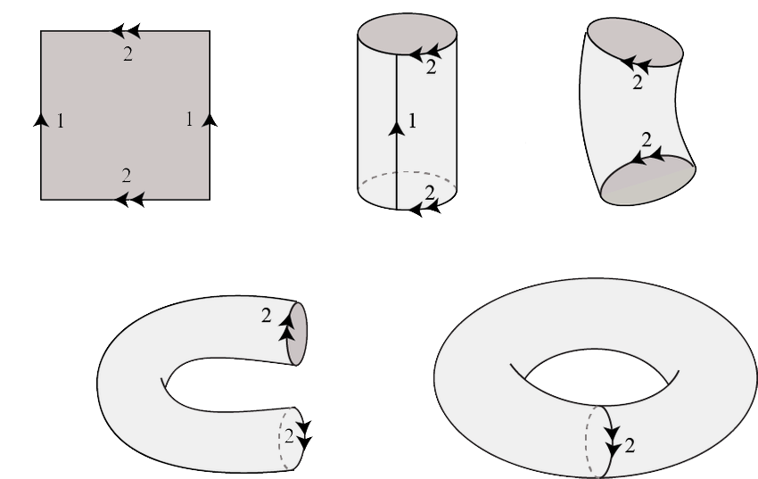
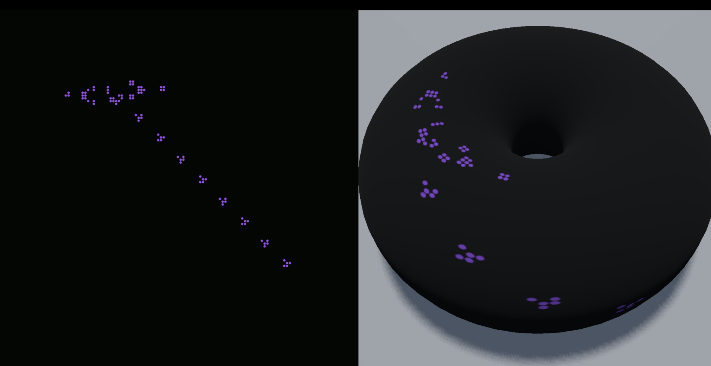
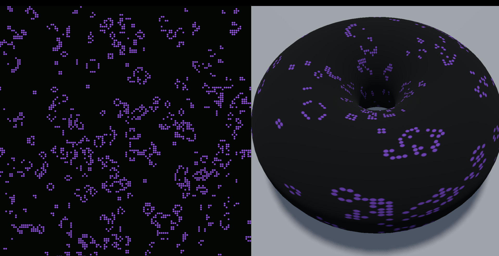
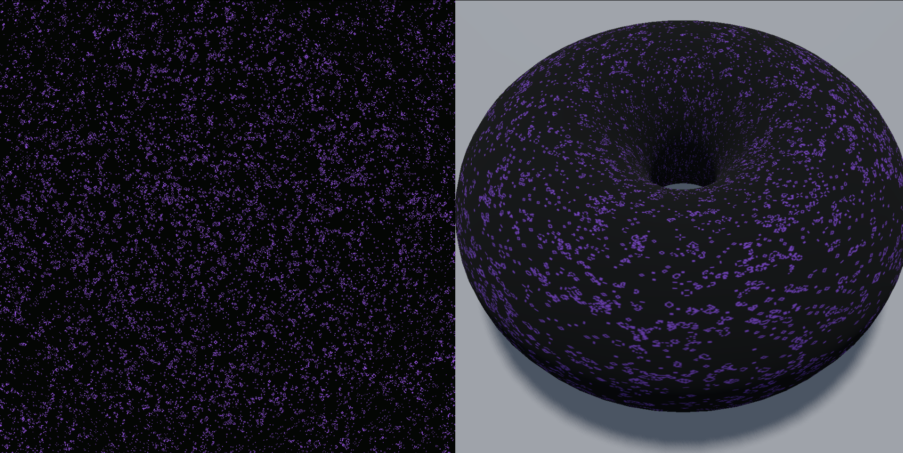

# Conway's Game of Life

Conway's **Game of Life** implementation in the **Godot Engine** (v4.2.1).

---

## 👾 About Conway's Game of Life
The **Game of Life** (by John Horton Conway in 1970) is a **cellular automaton** (a model of computation studied in **computational theory**) and it's **evolution** is determined by its **initial state**.

The game consists of an orthogonal, two-dimensional grid of square cells, each of which is in one of two possible states, **alive** or **dead**. 
Each cell interacts with its **neighbors** (the cells that are horizontally, vertically, or diagonally adjacent). 

At each step one of the following actions occurs:
  + Each live cell with two or three live neighbors moves on to the next generation (**surviving**).
  + Each live cell with fewer than two live neighbors dies (**underpopulated**).
  + Each live cell with more than three live neighbors dies (**overpopulated**).
  + Every dead cell with exactly three live neighbors becomes a live cell (**reproduction**).

> [!IMPORTANT]
> The Game of Life is Turing Complete! 🤩

## 🍩 Torus
Usually the Game of Life universe is defined as an infinite, two-dimensional, orthogonal grid of square cells, it can also be defined on a topological torus.

A topological torus is a topological space homeomorphic to a torus in Euclidean space. It can be defined as the product of two circumferences $C^1 \times C^2$
or equivalently consider a square and "glue" the opposite sides together. This corresponds to defining on the square 
$$S = [0, 1] \times [0,1] \subseteq \\mathbb{R}^2$$
the equivalence relation $∼_T$ such that $\forall\ p \in [0,1]$ and $B \in \\{0,1\\}$
$$x ∼_T y \Longleftrightarrow \bigg(x = y\bigg)\ \lor \bigg(x=(B,p) \land y=(1 - B,p) \bigg) \lor \bigg(x=(p,B) \land y=(p,1 - B) \bigg)$$
in other words, is a unique interior point or $x$ and $y$ are on two opposite sides and have an equal coordinate.

With this equivalence relation, we can define the quotient space $S / {∼_T}$ wich is a topological torus.

In the case of this project, the field of the game is a two-dimensional finite grid on a square that is converted to a texture and mapped onto the Euclidean torus.

## 🖼️ Screenshots
#### Simulation with the sample "Gosper's gliders cannon"

#### Simulation 128x128 cells, with initial state from a [Simplex noise](https://en.wikipedia.org/wiki/Simplex_noise) image.

#### Simulation 1024x1024 cells, with initial state from a [Simplex noise](https://en.wikipedia.org/wiki/Simplex_noise) image.

